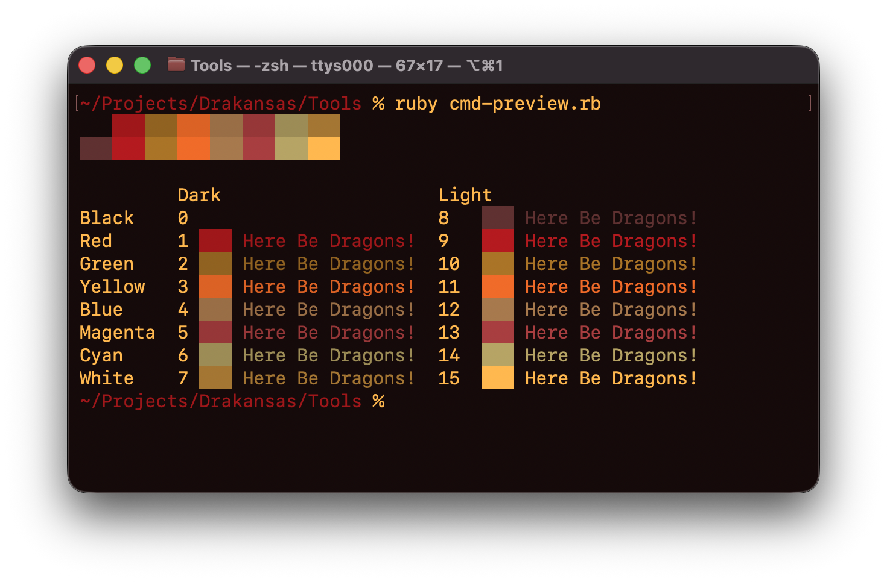
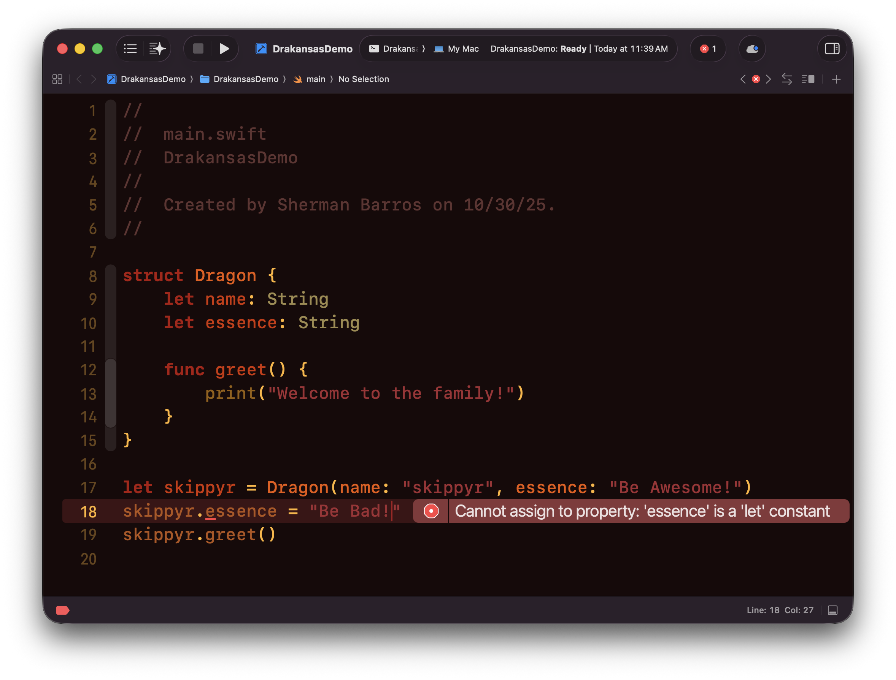

# Drakansas
## About
A stubborn coding theme I created to embrace who I am, and to remind that even in uncertain moments, there's always hope—maybe it can inspire you too. It's available for Terminal and Xcode.




## Install

- Clone this repository using `git`:
```zsh
git clone --depth 1 https://github.com/skippyr/Drakansas
```

- Install the Xcode theme.
```zsh
cp Drakansas/Themes/Drakansas.xccolortheme ~/Library/Developer/Xcode/UserData/FontAndColorThemes
```

- Reopen Xcode, then:
  - Open its settings.
  - Navigate to the `Themes` side menu.
  - Select the `Drakansas` theme from the dropdown menu on the top.
- Open Terminal, then:
  - Open its settings.
  - Navigate to the `Profiles > Text` tab, then click on the `(...)` icon on the bottom, followed by `Import...`.
  - Select the profile at `Drakansas/Themes/Drakansas.terminal`.
  - Select it in the side bar, then click on `Default` on the bottom.


## Help
If you need help related to this project, open a new issue in its [issues pages](https://github.com/skippyr/Drakansas/issues) or send an [e-mail](mailto:skippyr.developer@icloud.com) describing what is going on.

## Contributing
This project is open to review and possibly accept contributions in the form of bug reports and suggestions. If you are interested, send your contribution to its [pull requests page](https://github.com/skippyr/Drakansas/pulls) or via [e-mail](mailto:skippyr.developer@icloud.com).

## Copyright
This software is licensed under the MIT License. Refer to the `LICENSE` file that comes in its source code for more details.
